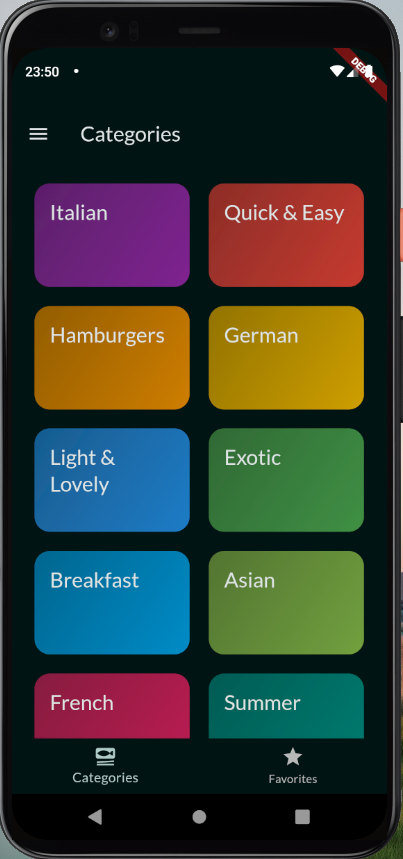
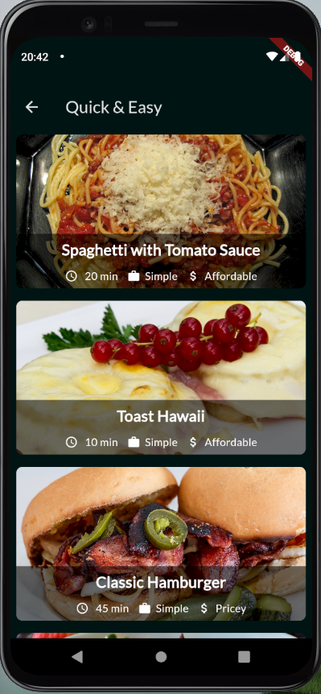
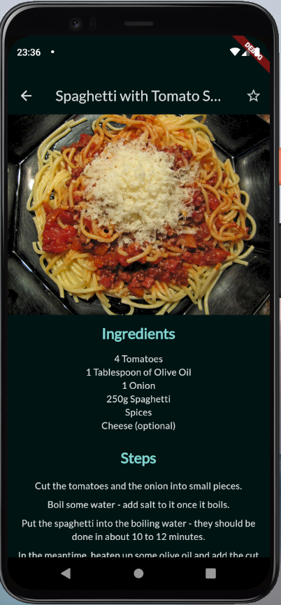

# Meals App
Navigation &amp; Multi-Screen Apps, allow users to navigate between screens

- Managing screen stacks
- Working with tab bars
- Using Side Drawers

|  |  |  |
|---|---|---|

## Starting the application
Before you begin, make sure you have Flutter installed and configured correctly on your machine. If you prefer, you can also use a mobile device emulator. After downloading and unzipping the project files, follow the steps below:

1. Open the terminal and navigate to the directory where the project files were saved.

2. Run the command below to ensure that all project dependencies are installed:

```
flutter pub get
```

3. After successfully installing the dependencies, start the application by running the following command:

```
flutter run
```

4. With this, the application should be compiled and run on the emulator or connected device.